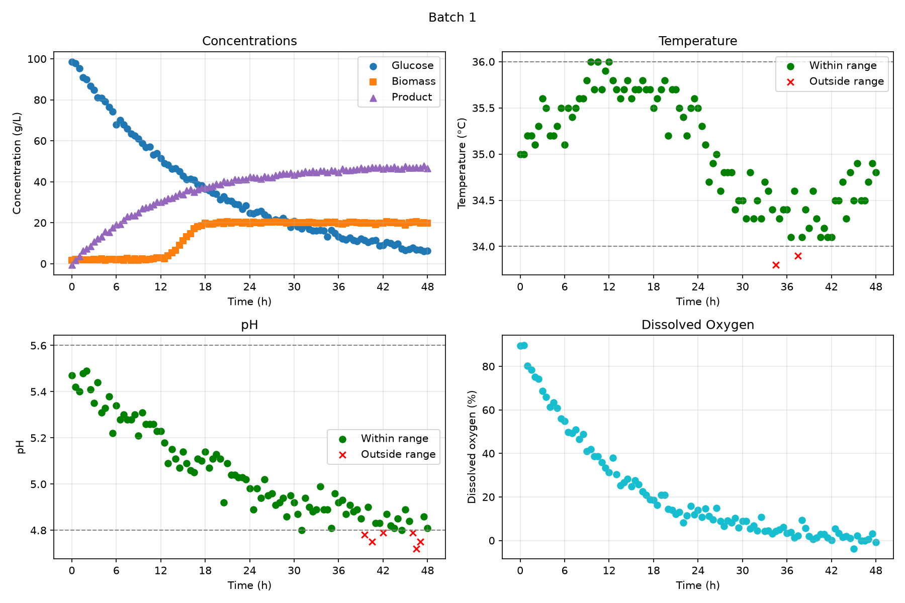

# BioProcess Controller

A program that classifies different batches of a bioprocess into different categories based on their pH, temperature, dissolved oxygen concentration, product and reactants.

## Goals of the project

In a bioprocess, temperature and pH can very much affect cell growth and is a main driver of how effective that certain batch may be 
viable.
1. Build a class that will analyze datasets of every single batch
2. Classify the data on each batch on given operation ranges 
3. Generate graphs that can easily be read to understand at which times the batch isn't in the right operation range
4. Make a summary table to determine which batches had the higher product concentration, and at which conditions that concentration was obtained

## Features

The bioprocess monitor class can create dashboards and tables using the dataset from the fermentation data. It can also check operating ranges for both temperature and pH. Also, the total number of batches can be counted

## Technologies

#### Python 3.14.7:

The programming language used

#### pandas-xyz:

Used to work with math in the given dataset. Is also used to make the summary tables

#### matplotlib-xyz:

Used to create all the dashboards. All the specific icons and lines are stored in this library.

## Code Design

In main.py the two different batch modes are defined with their respective pH and temperature limits.
Then a for loop is created to analyze all batches on both Modes, based on the dataset, then a nested for loop creates a file for all the batches, for each respective mode. Afterwards, it exports the file, looping 10 times for the 2 modes and 5 batches making 10 dashboards. Outside of the nested for loop, the two data summary tables are also created

In classes.py, the Bioprocess monitor class is located there, along with a lot of other methods.

The init method reads all the dataset and stores the temperature and pH limits to ensure that the other methods can use them.

The extract_batch method extracts the measurements from only a single batch, it makes sure that the batch id is the same for all those samples, and sorts them by their time.

The optimal_ph_mask method checks all the samples to make sure that it's within the pH limits. The optimal_temperature_mask method works the same way with temperature. They both use booleans to check that the value is between the range.

The get_n_batches method counts all the unique batches in the datasets using the nunique command, which checks to see the distinct batches in the dataset.

The export_dashboard method is the method that creates all the dashboards. First, by defining t as the horizontal axis as it is the case for every graph, and using the extract batch method to return the measurements for each batch.
Then, the subplots commands creates a 2x2 grid which will store each plot within the desire size (12x8) in this case, 4 in total, and each plot's place in that grid is defined on the following line.
Then, all the separate plots are built. For the concentrations, the substances are separately defined in a list with their respective label, colour and shape.
Then, the scatter function is called in a for loop to draw all the points with their respective settings according to the data, the axis labels and Titles are also set.
For temperature and pH, it is a similar process, but for this one the labels and colours are different if the data falls out of the defined range from the masks.
Additionally, a for loop is created to draw a horizontal gray line across the limit on both plots.
The final Dissolved oxygen plot is alot simpler, just requiring the scatter function once since there's only one data type in that plot.

Finally the for formatting, the x axis is added for time on all 4 plots using a for loop, and a tight layout function is called so the labels don't overlap, a suptitle function is added as a title for each respective batch id, the images are all saved and then closed, simply for the sake of not overloading the program, the images are all closed so that the 10 figures are not all opened at once to create clutter.

Then, the export_summary method is used to generate the tables with all the required data, mean functions are also used for the columns in which the optimal temperature and pH are inputted, in order to calculate the most optimal temperature and pH possible.

## Dashboard

Taking for example Batch 1 mode A

The dashboard contains all 4 plots as previously discussed, each with time as the x axis, and their respective y axis described in the title.
Top left contains the concentration plot, top right the temperature, bottom left the pH and bottom right the Dissolved oxygen concentration.
For pH and temperature, the required ranges are clearly indicated using the gray dotted lines, and the outliers are clear, noted by the red X's.
The two simpler plots of concentrations and dissolved oxygen simply show the trends with clear labels and colours indicating which data corresponds to which.

## Summary Table

Taking for example Summary of mode B

| batch_id | ph_optimal_percent | temperature_optimal_percent | C_product_g_L^-1_final |
|----------|--------------------|-----------------------------|------------------------|
| 1        | 36.08              | 51.55                       | 46.5                   |
| 2        | 34.71              | 55.37                       | 50.8                   |
| 3        | 36.99              | 46.58                       | 44.6                   |
| 4        | 54.12              | 62.35                       | 48.6                   |
| 5        | 16.51              | 49.54                       | 24.7                   |

The table shows the optimal pH percent and optimal temperature percent, calculated from the mean of the values that fall within the required range.
The final product concentration is also shown for each respective batch id.

The results clearly indicate that staying within the optimal ranges longer, will yield higher product concentrations, however the correlation isn't exact, as batch which contains the highest percentages in both ranges, only has the second highest product yield.

